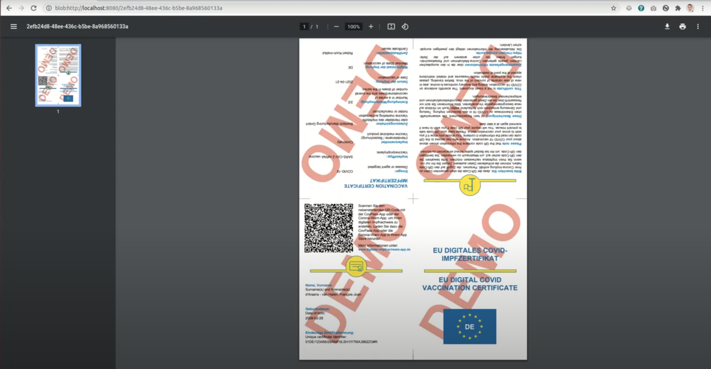
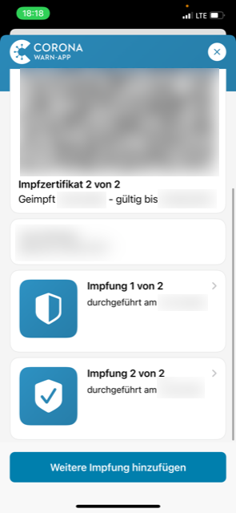

# dgc-ps-app
DGC Primary System Desktop Client Application of the Gematik TI

### Set Up Video

https://www.youtube.com/watch?v=0Cyj9nBQzO0

### Result for the doctor



Our solution will show the pdf to the doctor.
 
### Result for the patient



In the end the patient can scan the QR code with the [Corona-Warn-App](https://github.com/corona-warn-app), the [CovPass app Android](https://play.google.com/store/apps/details?id=de.rki.covpass.app) or [iOS](https://apps.apple.com/de/app/covpass/id1566140352)

### Overview
The dgc-ps-app is comprised of two main components. 

* The dgc-ps-app back-end which is a Java 11 Quarkus (https://quarkus.io/) application. See [API spec](doc/dgc-openapi.yaml) for details.
* The dgc-ps-app front-end UI, which is a browser based HTML, CSS and JavaScript application.


### Configuring the DGC-PS-App Front-End UI

Open a terminal window and do the following:

* Clone the ere-ps-app back-end repository by running: 
  > git clone https://github.com/ere-health/dgc-ps-app.git

The source files of the front-end UI will be located in the following directory location:
  > src/main/resources/META-INF/resources/dgc/

At this point, you should now have access to the source files for both the backend and front-end of 
the application. The forms support helpers to [pre-fill parameters](doc/FORMS.md) using an url.

### Routing
In order to reach the German certificate API (that is used by this system), the corresponding
routing needs to be set up throgh the card connector.

There are different routings needed for RU and PU:
| Environment | Subnet |
| ----- | ----- |
| `PU` | `100.102.0.0` |
| `RU` | `10.30.0.0` |

#### Linux
```
ip route add <SUBNET_DEPENDING_ON_RU_OR_PU>/16 via <IP_OF_THE_CARD_CONNECTOR>
```
(depending on the used linux distribution)

#### Windows
```
route ADD <SUBNET_DEPENDING_ON_RU_OR_PU> MASK 255.255.0.0 <IP_OF_THE_CARD_CONNECTOR>
```

### Running the DGC-PS-App Application

* #### Software Requirements
  1. Download and install the latest version of the OpenJDK 11 SDK. You can use your preferred 
     package manager software on your computer to handle this, or simply download an archive or 
     installer from a publishing site such as AdoptOpenJDK (https://adoptopenjdk.net/).  Make sure 
     to choose OpenJDK 11 (LTS) and the HotSpot version of the JVM.
     
  2. Download and install the latest version of Apache Maven (https://maven.apache.org/). 
    
  3. The latest Chrome Browser (https://www.google.com/chrome/).
 
    
* #### Running the Application (Development Mode)
  Open a terminal window and change to the parent dgc-ps-app directory of the back-end and then run 
  the following commands:
  
  Then run:
  
  > mvn quarkus:dev
  
  At this point, the application should be running as highlighted below.
  
  ```shell
    __  ____  __  _____   ___  __ ____  ______ 
     --/ __ \/ / / / _ | / _ \/ //_/ / / / __/ 
     -/ /_/ / /_/ / __ |/ , _/ ,< / /_/ /\ \   
    --\___\_\____/_/ |_/_/|_/_/|_|\____/___/   
    2021-06-14 08:25:16,406 INFO  [hea.ere.ps.ser.dgc.DigitalGreenCertificateService] (Quarkus Main Thread) Application started go to: http://localhost:8080/dgc/covid-19-certificate.html
    2021-06-14 08:25:16,479 INFO  [io.quarkus] (Quarkus Main Thread) ere-ps-app 1.0.0-SNAPSHOT on JVM (powered by Quarkus 1.13.1.Final) started in 2.250s. Listening on: http://0.0.0.0:8080
    2021-06-14 08:25:16,481 INFO  [io.quarkus] (Quarkus Main Thread) Profile dev activated. Live Coding activated.
    2021-06-14 08:25:16,481 INFO  [io.quarkus] (Quarkus Main Thread) Installed features: [cdi, rest-client, resteasy, resteasy-jsonb, servlet]
  ```
  You can access the front-end UI of the application by making reference to the following URL in a 
  browser!
  
  > http://localhost:8080/dgc/covid-19-certificate.html

* #### Create a standalone single jar-file
  Run
  
  > QUARKUS_PACKAGE_TYPE=uber-jar mvn package -DskipTests=true
  
  to create the file `target/ere-ps-app-VERSION-SNAPSHOT-runner.jar` which may then be started with
  
  > java -jar ere-ps-app-VERSION-SNAPSHOT-runner.jar


### Docker image
To create a docker image, the corresponding quarkus extension may be used:
```
mvn package -Dquarkus.container-image.build=true -DskipTests=true
```

This command will create a docker image called `ere.health/dgc:latest` which contains a service
that listens on port 8080. To locally start the image, the command
```
docker run --rm -p 127.0.0.1:8080:8080 ere.health/dgc:latest
```
may be used.

### Environment Variables

For configuration purposes, the environment variables referenced in the `application.properties` file
are located in a file named `.env`. This file should be located in the root project folder
(dgc-ps-app).
See https://quarkus.io/guides/config-reference#environment_variables for additional information.

If needed and the `.env` file is not present, create a copy of the file `.env.example` with name `.env`.
In regard to file and directory paths, configure the values for the environment variables in the
`.env` file to reference paths on your local computer.

> Important! Configure the .env file to be ignored and not checked into the source code repository.

| Environment variable | Description | Example |
| ----- | ----- | ----- |
| `QUARKUS_HTTP_HOST` | IP address that the service will listen on; if not supplied, the service will listen on **all** IP addresses of the system and will therefore be available via network access from other hosts | `127.0.0.1` |
| `CONNECTOR_CERT_AUTH_STORE_FILE` | File path to the client certificate that will be used to connect to the connector; may be empty; * | `p12:files/path/to/certificate.p12` |
| `CONNECTOR_CERT_AUTH_STORE_FILE_PASSWORD` | Password for accessing the certificate that is configured in `CONNECTOR_CERT_AUTH_STORE_FILE` | `changeit` |
| `CONNECTOR_CERT_TRUST_STORE_FILE` | File path to the certificate trust store that will be used to connect to the connector; may be empty; **Attention**: if not supplied, **ANY** tls certificate will be accepted which makes the connection to the connector vulnerable to MITM attacks; * | `jks:files/keystore` |
| `CONNECTOR_CERT_TRUST_STORE_FILE_PASSWORD` | Password for accessing the trust store that is configured in `CONNECTOR_CERT_TRUST_STORE_FILE` | `changeitaswell` |
| `CONNECTOR_CLIENT_SYSTEM_ID` | Client system id that will be used to access the connector | `client123` |
| `CONNECTOR_MANDANT_ID` | Mandant that will be used for the connector | `MANDANT1234` |
| `CONNECTOR_WORKPLACE_ID` | Workplace id that will be used for the connector | `12345` |
| `CONNECTOR_CARD_HANDLE` | Card handle that will be used for the connector; optional - if not supplied, the card handle will be detected automatically | `SMB-C-123` |
| `CONNECTOR_USER_ID` | User id that will be used for the connector | `user123` |
| `CONNECTOR_USER_PASSWORD` | Password for `CONNECTOR_USER_ID`; only required if the connector is accessed via username and password; will be used for **all** requests to the connector | `someStrongPassword` |
| `CONNECTOR_BASE_URI` | Base URI for the connector (protocol+host+port); will be used for discovery via `/connector.sds` of the other connector endpoints (see `*_ENDPOINT_ADDRESS`) | `https://192.168.1.1` |
| `CONNECTOR_VERIFY_HOSTNAME` | Set to `false` to disable host name verification when using TLS for the connector | `true` |
| `IDP_BASE_URL` | Base URL for the IDP | `https://id.impfnachweis.info/auth/realms/bmg-ti-certify` |
| `IDP_CLIENT_ID` | Client id for the auth procedure with the IDP to get a token for the certificate creation service; should be `user-access-ti` | `user-access-ti` |
| `IDP_AUTH_REQUEST_REDIRECT_URL` | Redirect URL that will be called by the IDP; should be `connector://authenticated` | `connector://authenticated` |
| `DIGITAL_GREEN_CERTIFICATE_SERVICE_ISSUERAPIURL` | URL of the public digital green certificate service | `https://api.impfnachweis.info` |
| `EVENT_SERVICE_ENDPOINT_ADDRESS` | Endpoint for the event SOAP-service; fallback if `CONNECTOR_BASE_URI` could not be used to determine it | `https://192.168.1.1/EventService` |
| `CARD_SERVICE_ENDPOINT_ADDRESS` | Endpoint for the card SOAP-service; fallback if `CONNECTOR_BASE_URI` could not be used to determine it | `https://192.168.1.1/CardService` |
| `AUTH_SIGNATURE_SERVICE_ENDPOINT_ADDRESS` | Endpoint for the auth signature SOAP-service; fallback if `CONNECTOR_BASE_URI` could not be used to determine it | `https://192.168.1.1/AuthSignatureService` |
| `CERTIFICATE_SERVICE_ENDPOINT_ADDRESS` | Endpoint for the certificate SOAP-service; fallback if `CONNECTOR_BASE_URI` could not be used to determine it | `https://192.168.1.1/CertificateService` |

_Hint *_: the file path may be prefixed with either `p12:` or `jks:` to indicate the key store type; if no prefix is
supplied, `p12:` will be assumed. Some data-urls are supported as well:
* `data:application/x-pkcs12;base64,`

#### Environment Variables for tests

| Environment variable | Description | Example |
| ----- | ----- | ----- |
| `IDP_AUTH_REQUEST_URL` | Request URL for the IDP | `not-used` |
| `TEST_ENVIRONMENT` | Environment to enable tests for RU; the value must set to `RU` enable this tests. | `RU` |
